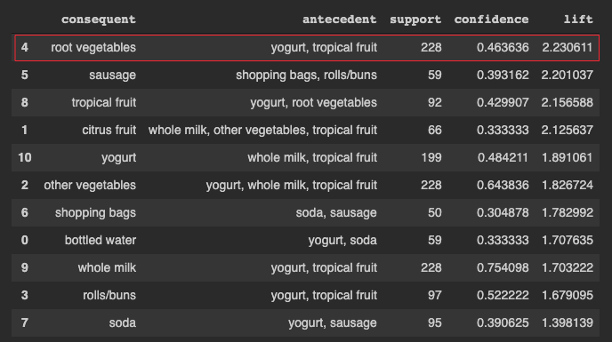

# Cross Selling - Market Basket Analysis - Association Rules Mining
[Market Basket Analysis](https://smartbridge.com/market-basket-analysis-101/) is one of the key techniques used by large retailers to uncover associations between items, which is very important for [Cross selling](https://www.oberlo.com/ecommerce-wiki/cross-selling) - a practice of selling additional products to an existing customer.

[Association Rules Mining](https://www.geeksforgeeks.org/association-rule/) is widely used to analyze retail basket or transaction data, and are intended to identify strong rules discovered in transaction data using measures of interestingness, based on the concept of strong rules.

In this notebook, we will perform Association Rules Mining using [FP-Growth algorithm](https://www.softwaretestinghelp.com/fp-growth-algorithm-data-mining/) implemented in the [orange3-associate package](https://pypi.org/project/Orange3-Associate/) on an `retail transactions` dataset and interpret the results.

**A snapshot of the result:**

The pattern that the rule states in the equation is easy to understand—people who bought `yogurt` and `tropical fruit` also tend to buy `root vegetables`. Let’s try to understand the metrics: 
- `Support` of the rule is 228, which means, all the items together appear in 228 transactions in the dataset. 
- `Confidence` of the rule is 46%, which means that 46% of the time the antecedent items occurred we also had the consequent in the transaction (i.e. 46% of times, customers who bought `yogurt` and `tropical fruit` also tend to buy `root vegetables`).
- `Lift` means that the probability of finding `root vegetables`
in the transactions which have `yogurt` and `tropical fruit` is greater than the normal probability of finding `root vegetables` in the previous transactions (2.23). Typically, a lift value of 1 indicates that the probability of occurrence of the antecedent and consequent together are independent of each other. Hence, ***the idea is to look for rules having a lift much greater than 1***. In our case, all the previously mentioned rules are good quality rules.
